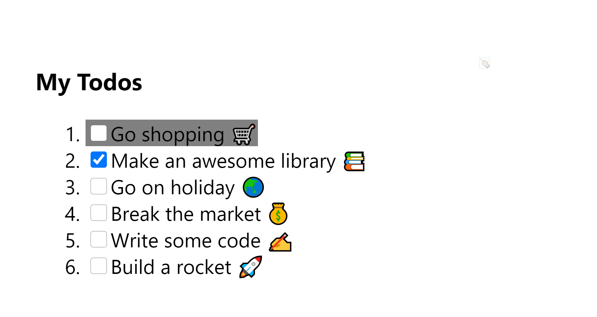

# react-list-hotkeys

## A utilty library to easily setup list hokeys

**With one simple hook, setup all the hotkeys you need** to allow
your users to navigate and select items from a list.

[](https://www.npmjs.com/package/react-list-hotkeys) [](https://standardjs.com)

## Install

```bash
npm i react-list-hotkeys
```

## Usage

```tsx
import { useListHotkeys } from "react-list-hotkeys";

...
// inside a component
const [selectedIndex, setSelectedIndex] = useListHotkeys(data, ({item, index}) => ...)
```

## Example

Live [here](https://hayke102.github.io/react-list-hotkeys/)


### the code behind:

```tsx
const App = () => {
  const [todos, setTodos] = useState(INITIAL_TODOS);

  const toggleTodo = (index: number) => {
    const newTodos = [...todos];
    const newItem = { ...newTodos[index] };
    newItem.done = !newItem.done;
    newTodos[index] = newItem;
    setTodos(newTodos);
  };

  const [selectedIndex, setSelectedIndex] = useListHotkeys(
    todos,
    ({ item, index }) => {
      console.log(`selected item:${item} index:${index}`);
      toggleTodo(index);
    }
  );

  return (
    <div>
      <h3>My Todos</h3>
      <ol>
        {todos.map((todo, index) => (
          <li key={index}>
            <span className={index === selectedIndex ? "selected" : ""}>
              <input type="checkbox" checked={todo.done} readOnly />
              {todo.text}
            </span>
          </li>
        ))}
      </ol>
    </div>
  );
};
```

## Call Signature

```ts
useListHotkeys(
  hotkeys: T | null,
  onSelect: ({item: T, index:number}) => void,
  optionsOverride: Options
) => [selectedIndex: number, setSelectedIndex: SetState<number>];
```

### Options

A full list of valid keys can be found on [MDN](https://developer.mozilla.org/en-US/docs/Web/API/KeyboardEvent/key/Key_Values)

```ts
{
  keys: {
    up: string; // Default: ArrowUp
    down: string; // Default: ArrowDown
    select: string; // Default: Enter
  },
  events: {
    onDown: DispatchWithoutAction;
    onUp: DispatchWithoutAction;
  }
}
```

## License

MIT © [hayke102](https://github.com/hayke102)
